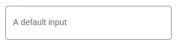

import { Playground, Props } from 'docz'
import Field from './src/docs/Field.doc'
import { InputField, Form } from './src/lib'

## Introduction

Form Component Module is react component package that wraps up [informed](https://github.com/joepuzzo/informed) and
adds some material design style.

## Installation

You can install it using `yarn`:

    yarn add @redwallsolutions/form-component-module

Or using `npm`:

    npm i @redwallsolutions/form-component-module

### Available Components

    {InputField, Form} from '@redwallsolution/form-component-module'

## Props

<Props of={Field} />

## Usage

### Simplest Form

<Playground>
	<InputField field="somename" label="My Input" />
</Playground>

### Password Type

<Playground>
	<InputField field="password" label="What's your password?" type="password" />
</Playground>

### With informed form
<Playground>
	<Form onSubmit={console.log}>
		<InputField field="somefield" label="Some Field" />
		<InputField field="OtherField" label="Other Field" />
        <button type="submit">Save</button>
        
<small><em>Pro tip: After save it, look at console!</em></small>

	</Form>
</Playground>
